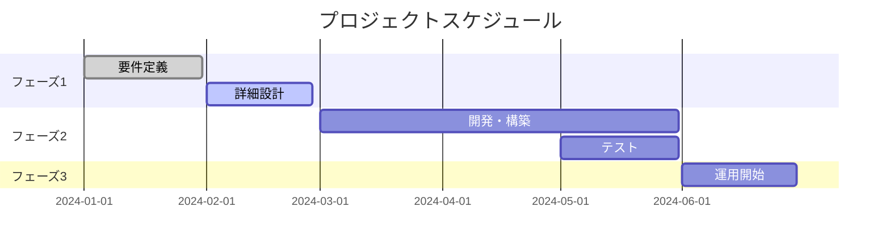

<!-- _class: lead -->
# ビジネス提案書テンプレート

**[提案先企業名] 様**

[発表日：YYYY年MM月DD日]
[提案者：[会社名] [部署名] [氏名]]

---

# アジェンダ

1. **現状課題の整理**
2. **提案概要**
3. **解決策の詳細**
4. **実施計画・スケジュール**
5. **投資対効果**
6. **リスクと対策**
7. **まとめ・次のステップ**

---

<!-- _class: lead -->
# 1. 現状課題の整理

---

## 貴社を取り巻く環境

### 市場環境
- 市場動向の変化
- 競合他社の動向
- 顧客ニーズの変化

### 内部課題
- 業務効率の問題
- システム・インフラの課題
- 人材・スキルの課題

---

## 課題の影響度分析

| 課題項目 | 影響度 | 緊急度 | 現状対応 |
|---------|--------|--------|----------|
| 課題A | 高 | 高 | 未対応 |
| 課題B | 中 | 高 | 部分対応 |
| 課題C | 高 | 中 | 検討中 |

**→ 早急な対策が必要**

---

<!-- _class: lead -->
# 2. 提案概要

---

## 提案のポイント

### 🎯 **目標**
[具体的な目標設定]

### 💡 **アプローチ**
[解決方法の概要]

### 📈 **期待効果**
[定量的・定性的効果]

---

## 提案内容のサマリー

```markdown
【何を】[提案する内容・サービス]
【なぜ】[提案理由・背景]
【どのように】[実現方法・手段]
【いつまでに】[実施期間・スケジュール]
【いくらで】[投資金額・コスト]
```

---

<!-- _class: lead -->
# 3. 解決策の詳細

---

## ソリューション構成


### 主要コンポーネント
1. **コンポーネントA**: [機能・役割]
2. **コンポーネントB**: [機能・役割]
3. **コンポーネントC**: [機能・役割]

---

## 技術仕様・機能詳細

### 機能一覧
| 機能名 | 概要 | 効果 |
|--------|------|------|
| 機能1 | [詳細説明] | [期待効果] |
| 機能2 | [詳細説明] | [期待効果] |
| 機能3 | [詳細説明] | [期待効果] |

### 技術要件
- **プラットフォーム**: [OS/環境]
- **データベース**: [DB種類/バージョン]
- **セキュリティ**: [セキュリティ要件]

---

<!-- _class: lead -->
# 4. 実施計画・スケジュール

---

## プロジェクト全体スケジュール

### フェーズ1: 準備・設計 (1-2ヶ月)
- 要件定義
- 詳細設計
- 環境構築

### フェーズ2: 開発・構築 (3-4ヶ月)
- システム開発
- テスト実施
- ユーザー研修

### フェーズ3: 運用開始 (5-6ヶ月)
- 本格運用開始
- 運用サポート
- 効果測定

---

## マイルストーン



---

<!-- _class: lead -->
# 5. 投資対効果

---

## 💰 投資概算

### 初期投資
**システム開発費**: ¥XX,XXX,XXX  
**ライセンス費用**: ¥XX,XXX,XXX  
**導入支援費用**: ¥XX,XXX,XXX

# 合計: ¥XX,XXX,XXX

### 年間運用費
**保守・サポート**: ¥X,XXX,XXX  
**インフラ費用**: ¥X,XXX,XXX

---

## ROI分析

### 効果測定指標
- **コスト削減**: 年間 ¥XX,XXX,XXX
- **生産性向上**: XX%アップ
- **売上増加**: 年間 ¥XX,XXX,XXX

### 投資回収期間
**約X.X年で投資回収**


---

<!-- _class: lead -->
# 6. リスクと対策

---

## 主要リスクと対策

### 技術的リスク
| リスク | 対策 |
|--------|------|
| 技術的課題 | [具体的対策] |
| パフォーマンス | [具体的対策] |
| セキュリティ | [具体的対策] |

### 運用リスク
| リスク | 対策 |
|--------|------|
| ユーザー受入 | [具体的対策] |
| スケジュール遅延 | [具体的対策] |
| 予算超過 | [具体的対策] |

---

<!-- _class: lead -->
# 7. まとめ・次のステップ

---

## 提案のまとめ

### 💎 **提案価値**
1. [価値ポイント1]
2. [価値ポイント2]
3. [価値ポイント3]

### 🚀 **期待効果**
- **短期**: [3-6ヶ月での効果]
- **中期**: [1-2年での効果]
- **長期**: [3年以上での効果]

---

## 次のステップ

### 今後のプロセス

1. **提案内容のご検討** (1週間)
2. **詳細ヒアリング** (2週間)
3. **正式見積もり提出** (1週間)
4. **契約締結** (2週間)
5. **プロジェクト開始** (1ヶ月後)

### お願い事項
- ご質問・ご要望の確認
- 社内関係者との調整
- 予算・スケジュールの確認

---

<!-- _class: lead -->
# ご質問・ご相談

**ありがとうございました**

[連絡先情報]
- 担当者：[氏名]
- Email：[email@company.com]
- Tel：[電話番号]
- 会社：[会社名]
