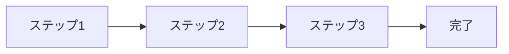

# スライドレイアウトパターン集

## レイアウトパターンの使い方

### 基本方針
- **1スライド1メッセージ**: 伝えたいことを1つに絞る
- **情報量の制限**: 視覚的に読みやすい分量を保つ
- **統一感**: 一貫したレイアウトパターンを使用
- **視認性**: 適切なフォントサイズと余白を確保

### 重要なデザインガイドライン
- **スライドタイトル (##) は必ず1行に収める**: 全角30文字以内
- **1行あたりの文字数**: 全角35〜45文字
- **箇条書きの項目数**: 5〜7個まで
- **テーブルの列数**: 3〜4列まで

---

## Pattern 1: タイトルスライド

```markdown
<!-- _class: lead -->
# メインタイトル
## サブタイトル

**補足情報**

作成日：YYYY年MM月DD日
作成者：[氏名]
```

### 使用場面
- プレゼンテーションの開始
- セクションの区切り

---

## Pattern 2: リストスライド（基本）

```markdown
## タイトル

### ポイント1
- 項目A
- 項目B
- 項目C（最大3-4項目）

### ポイント2
- 項目D
- 項目E
```

### 注意点
- リスト項目は最大5個まで
- 階層は2レベルまで
- 各項目は1行で表現

---

## Pattern 3: 比較表スライド

```markdown
## 比較タイトル

| 項目 | A案 | B案 |
|------|-----|-----|
| コスト | ¥100万 | ¥200万 |
| 期間 | 3ヶ月 | 6ヶ月 |
| 効果 | 高 | 中 |

**結論：A案を推奨**
```

### レイアウトルール
- 列数は最大4列
- セル内は短い単語・数値
- 表の下に結論を配置

---

## Pattern 4: 図表メインスライド

```markdown
## タイトル


### ポイント
- 図表の要点1
- 図表の要点2
```

### 画像サイズ指定
- **幅指定**: `![width:700px]`
- **高さ指定**: `![height:400px]`
- **背景画像**: `![bg fit]`

---

## Pattern 5: 2カラムレイアウト

```markdown
## タイトル


### 右側コンテンツ
- ポイント1
- ポイント2
- ポイント3

**補足説明文**
```

### バリエーション
- `![bg left:30%]` - 左30%
- `![bg left:50%]` - 左50%
- `![bg right:40%]` - 右40%

---

## Pattern 6: コードブロックスライド

```markdown
## コード例

### 実装方法
\`\`\`python
# 短いコード例（10行以内）
def example():
    return "Hello World"
\`\`\`

### ポイント
- 簡潔なコード
- 重要部分のハイライト
```

### コード表示ルール
- 1スライドあたり10行以内
- 重要な部分のみ抜粋
- 言語指定を必須

---

## Pattern 7: 数字・統計スライド

```markdown
## 実績データ

### 主要指標

**売上**
# ¥1,200万
→ 前年比120%

**顧客数**  
# 2,400社
→ 新規獲得500社
```

### 数字表現のポイント
- 大きな数字は見出しレベルで強調
- 比較データを併記
- 矢印で変化を表現

---

## Pattern 8: プロセス・フロースライド

```markdown
## プロセスフロー



### 各ステップの詳細
1. **ステップ1**: 説明
2. **ステップ2**: 説明
```

### Mermaid図表のサイズ制御
- 横幅は最大800px相当
- ノード数は最大6個
- 複雑な図は複数スライドに分割

---

## Pattern 9: 課題・解決策スライド

```markdown
## 課題と解決策

### 🔴 課題
現状の問題点を簡潔に

### 💡 解決策
提案する解決方法

### ✅ 効果
期待される改善効果
```

### アイコンの活用
- 🔴 問題・課題
- 💡 提案・アイデア
- ✅ 効果・成果
- ⚠️ 注意・リスク
- 🚀 将来・展望

---

## Pattern 10: まとめスライド

```markdown
<!-- _class: lead -->
# まとめ

## 重要ポイント3つ

1. **ポイント1**
2. **ポイント2** 
3. **ポイント3**

### 次のアクション
- アクション1
- アクション2
```

---

## レスポンシブ対応の考慮事項

### 画面サイズ別調整
```markdown
# モバイル対応
- フォントサイズ: 最小16px
- リスト項目: 最大3個
- 画像幅: 最大100%

# デスクトップ対応
- フォントサイズ: 18px以上
- リスト項目: 最大5個
- 画像幅: 700px推奨
```

---

## 品質チェックリスト

### レイアウト確認
- [ ] 1スライド1メッセージが守られている
- [ ] 情報量が適切（画面内に収まる）
- [ ] 画像サイズが指定されている
- [ ] 表の列数が4列以下
- [ ] リスト項目が5個以下

### 視認性確認
- [ ] フォントサイズが適切
- [ ] 色のコントラストが十分
- [ ] 余白が適切に配置されている
- [ ] アニメーション・装飾が過剰でない

---

## よくある問題と対策

### 問題1: テキストが多すぎる
**対策**: 要点を3つに絞る、詳細は別スライドへ

### 問題2: 表が画面からはみ出る
**対策**: 列数を減らす、縦方向のレイアウトに変更

### 問題3: 画像が小さすぎる/大きすぎる
**対策**: `width:`または`height:`でサイズ指定

### 問題4: Mermaid図が複雑すぎる
**対策**: 図を分割、ノード数を6個以下に制限

---

## テンプレート選択ガイド

### ビジネス提案向け
- Pattern 1: タイトル
- Pattern 3: 比較表
- Pattern 6: 課題・解決策
- Pattern 10: まとめ

### 技術資料向け  
- Pattern 4: 図表メイン
- Pattern 6: コードブロック
- Pattern 8: プロセス・フロー
- Pattern 7: 数字・統計

### 報告書向け
- Pattern 2: リスト基本
- Pattern 7: 数字・統計
- Pattern 8: プロセス・フロー
- Pattern 9: 課題・解決策
