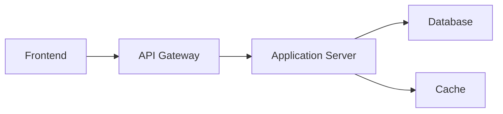
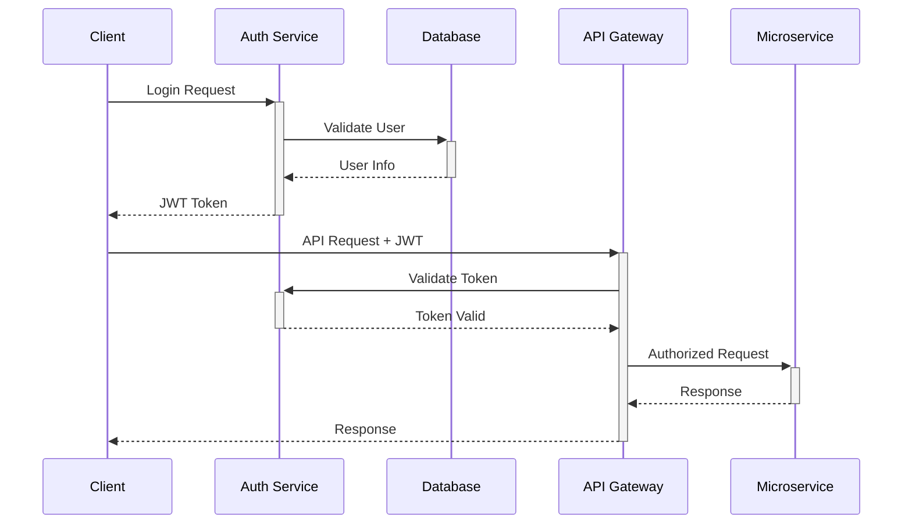

<style>
/* Google Fontsから日本語フォントを読み込み */
@import url('https://fonts.googleapis.com/css2?family=Noto+Sans+JP:wght@400;700&display=swap');

/* --- 色やフォントの基本設定 --- */
:root {
  --color-background: #f8f8f4;
  --color-foreground: #3a3b5a;
  --color-heading: #4f86c6;
  --color-hr: #000000;
  --font-default: 'Noto Sans JP', 'Hiragino Kaku Gothic ProN', 'Meiryo', sans-serif;
}

/* --- スライド全体のスタイル --- */
section {
  background-color: var(--color-background);
  color: var(--color-foreground);
  font-family: var(--font-default);
  font-weight: 400;
  box-sizing: border-box;
  border-bottom: 8px solid var(--color-hr);
  position: relative;
  line-height: 1.7;
  font-size: 22px;
  padding: 56px;
}
section:last-of-type {
  border-bottom: none;
}

/* --- 見出しのスタイル --- */
h1, h2, h3, h4, h5, h6 {
  font-weight: 700;
  color: var(--color-heading);
  margin: 0;
  padding: 0;
}

/* タイトルページ(h1)のスタイル */
h1 {
  font-size: 56px;
  line-height: 1.4;
  text-align: left;
}

/* 通常スライドのタイトル(##) */
h2 {
  position: absolute;
  top: 40px;
  left: 56px;
  right: 56px;
  font-size: 40px;
  padding-top: 0;
  padding-bottom: 16px;
}

/* h2の疑似要素(::after)を使って、短い線を実装 */
h2::after {
  content: '';
  position: absolute;
  left: 0;
  bottom: 8px;
  width: 60px;
  height: 2px;
  background-color: var(--color-hr);
}

/* h2と後続コンテンツの間のスペースを確保 */
h2 + * {
  margin-top: 112px;
}

/* サブ見出し (例: 目的, 目標) */
h3 {
  color: var(--color-foreground);
  font-size: 28px;
  margin-top: 32px;
  margin-bottom: 12px;
}

/* --- リストのスタイル --- */
ul, ol {
  padding-left: 32px;
}
li {
  margin-bottom: 10px;
}

/* --- コードブロックのスタイル --- */
code {
  font-size: 0.85em;
  background: #f7fafc;
  padding: 0.2em 0.4em;
  border-radius: 3px;
  font-family: "Fira Code", "Source Code Pro", "Consolas", "Monaco", monospace;
}

pre {
  font-size: 0.8em;
  max-height: 400px;
  overflow-y: auto;
  background: #f7fafc;
  padding: 1em;
  border-radius: 8px;
}

/* --- テーブルのスタイル --- */
table {
  width: 90%;
  margin: 1em auto;
  border-collapse: collapse;
  font-size: 0.85em;
}

th, td {
  padding: 0.7em 0.5em;
  text-align: left;
  border-bottom: 1px solid #e2e8f0;
}

th {
  background-color: #f7fafc;
  font-weight: 600;
  border-bottom: 2px solid #cbd5e0;
}

tr:hover {
  background-color: #f9fafb;
}

/* フッターとして機能する、太い青いラインを実装 */
footer {
  font-size: 0;
  color: transparent;
  position: absolute;
  left: 56px;
  right: 56px;
  bottom: 40px;
  height: 8px;
  background-color: var(--color-heading);
}

/* ★★★ ロゴの配置方法を、calc()を使った最も堅牢な方法に変更 ★★★ */
header {
  font-size: 0;
  color: transparent;
  background-image: url('ロゴ.png');
  background-repeat: no-repeat;
  background-size: contain;
  background-position: top right;
  
  position: absolute;
  top: 40px;
  
  /* rightプロパティの代わりに、calc()で左からの位置を計算して配置を安定させます */
  /* 計算式: (コンテナの幅 - ロゴの幅 - 右の余白) */
  left: calc(100% - 180px - 56px);
  
  /*
    【重要】下のwidthの値を変更した場合、
    上のcalc()内の「180px」も同じ値にしてください。
  */
  width: 180px;
  height: 50px;
}

/* --- 特別なクラス --- */
section.lead {
  border-bottom: 8px solid var(--color-hr);
}

/* タイトルページではフッターラインとロゴ(header)を非表示にする */
section.lead footer,
section.lead header {
  display: none;
}

section.lead h1 {
  margin-bottom: 24px;
}
section.lead p {
  font-size: 24px;
  color: var(--color-foreground);
}
</style>

<!-- _class: lead -->
# ABC社様
# XXX技術提案書

提案日：YYYY年MM月DD日  
技術リード：[氏名]  
所属：[部署名・会社名]

---

## アジェンダ

1. **背景・目的**
2. **現状分析**
3. **技術課題の特定**
4. **提案する技術・手法**
5. **アーキテクチャ設計**
6. **実装計画**
7. **検証・テスト戦略**
8. **まとめ・Q&A**

---

<!-- _class: lead -->
# 1. 背景・目的

---

## プロジェクト背景

### ビジネス要件
- **目標**: [ビジネス目標]
- **課題**: [解決したい課題]
- **制約**: [技術的・予算的制約]

### 技術要件
- **パフォーマンス**: [性能要件]
- **スケーラビリティ**: [拡張性要件]
- **セキュリティ**: [セキュリティ要件]
- **保守性**: [運用・保守要件]

---

## 成功指標

### 定量的指標
- **パフォーマンス**: レスポンス時間 < XXXms
- **可用性**: 99.9%以上
- **スループット**: XXXreq/sec
- **エラー率**: < 0.1%

### 定性的指標
- **開発効率**: 開発速度の向上
- **運用品質**: 障害対応時間の短縮
- **ユーザー満足度**: UXの改善

---

<!-- _class: lead -->
# 2. 現状分析

---

## 現在のシステム構成



### 主要コンポーネント
- **Frontend**: [技術スタック]
- **Backend**: [技術スタック]
- **Database**: [DB種類・バージョン]
- **Infrastructure**: [インフラ構成]

---

## パフォーマンス分析

### ボトルネック特定

| コンポーネント | CPU使用率 | メモリ使用率 | レスポンス時間 |
|----------------|-----------|--------------|----------------|
| Frontend | 45% | 60% | 150ms |
| API Server | 80% | 85% | 800ms |
| Database | 70% | 90% | 500ms |

**→ API ServerとDatabaseがボトルネック**

---

## 技術的負債

### 主要な課題
1. **レガシーコード**: [具体的な問題]
2. **依存関係**: [ライブラリ・フレームワークの課題]
3. **アーキテクチャ**: [設計上の問題]
4. **テスト**: [テストカバレッジ・品質の問題]

### 影響度評価
- **開発速度**: 30%低下
- **バグ率**: 通常の2倍
- **運用コスト**: 40%増加

---

<!-- _class: lead -->
# 3. 技術課題の特定

---

## 優先度マトリックス

| 課題 | 影響 | 複雑度 | 優先度 |
|------|------|--------|--------|
| スケーラビリティ | 🔴 高 | 🟡 中 | ⭐⭐⭐ |
| セキュリティ強化 | 🔴 高 | 🔴 高 | ⭐⭐ |
| コード品質改善 | 🟡 中 | 🟡 中 | ⭐ |
| モニタリング強化 | 🟡 中 | 🟢 低 | ⭐ |

---

## 課題詳細

### 1. スケーラビリティ課題
```
問題: 現状のモノリシック構成では水平拡張が困難
影響: ピーク時のパフォーマンス低下
対策: マイクロサービス化の検討
```

### 2. セキュリティ課題
```
問題: 認証・認可の仕組みが不十分
影響: セキュリティリスクの増大
対策: 統一認証基盤の導入
```

---

<!-- _class: lead -->
# 4. 提案する技術・手法

---

## 技術選定方針

### 選定基準
1. **成熟度**: 実績のある技術
2. **学習コスト**: チームのスキルセット
3. **エコシステム**: コミュニティ・サポート
4. **将来性**: 長期的な技術トレンド

### 制約条件
- **予算**: [予算制約]
- **期間**: [開発期間制約]
- **リソース**: [人的リソース制約]

---

## 提案技術スタック

### 🎨 Frontend
```typescript
// React + TypeScript
React 18 + TypeScript 5.0
Next.js 14, TailwindCSS
```

### ⚙️ Backend  
```python
# Python FastAPI
FastAPI 0.104 + SQLAlchemy 2.0
PostgreSQL 15, Redis 7.0
```

### ☁️ Infrastructure
```yaml
# Kubernetes + Docker
Docker + Kubernetes
AWS EKS / GCP GKE
Terraform for IaC
```

---

## 選定理由

### React + TypeScript
- **メリット**: 型安全性、開発効率
- **デメリット**: 学習コスト
- **代替案**: Vue.js, Angular

### FastAPI
- **メリット**: 高パフォーマンス、自動ドキュメント生成
- **デメリット**: 比較的新しい
- **代替案**: Django, Flask

### Kubernetes
- **メリット**: スケーラビリティ、ポータビリティ
- **デメリット**: 運用複雑度
- **代替案**: Docker Swarm, ECS

---

<!-- _class: lead -->
# 5. アーキテクチャ設計

---

## 全体アーキテクチャ


### 🏗️ 3層アーキテクチャ
**Frontend**: React App + CDN  
**API**: Gateway + Microservices  
**Data**: PostgreSQL + Redis + Storage

---

## マイクロサービス分割

### サービス境界
1. **User Service**: ユーザー管理・認証
2. **Product Service**: 商品情報管理
3. **Order Service**: 注文処理
4. **Payment Service**: 決済処理
5. **Notification Service**: 通知・メール

### データ管理戦略
- **Database per Service**: 各サービス独立DB
- **Saga Pattern**: 分散トランザクション
- **CQRS**: コマンド・クエリ責任分離

---

## セキュリティ設計

### 認証・認可


---

## データフロー設計

### 同期通信
- **REST API**: CRUD操作
- **GraphQL**: 複雑なクエリ

### 非同期通信
- **Message Queue**: RabbitMQ/Apache Kafka
- **Event Sourcing**: イベント駆動アーキテクチャ

### キャッシュ戦略
- **Redis**: セッション・一時データ
- **CDN**: 静的コンテンツ
- **Application Cache**: ORM レベル

---

<!-- _class: lead -->
# 6. 実装計画

---

## 開発フェーズ

### Phase 1: 基盤構築 (1-2ヶ月)
- 開発環境セットアップ
- CI/CDパイプライン構築
- 基本的なマイクロサービス実装

### Phase 2: コア機能開発 (3-5ヶ月)
- ユーザー管理機能
- 基本的なビジネスロジック
- フロントエンド実装

### Phase 3: 拡張機能・最適化 (6-8ヶ月)
- 高度な機能実装
- パフォーマンス最適化
- セキュリティ強化

---

## 技術スパイク

### 実施予定のPoC
1. **マイクロサービス間通信**: 1週間
2. **認証・認可システム**: 2週間
3. **データベース分割戦略**: 1週間
4. **デプロイメントパイプライン**: 1週間

### 検証項目
- パフォーマンス目標達成の確認
- セキュリティ要件の実現可能性
- 運用・保守の負荷評価

---

## リソース配置

### 開発チーム構成
- **Tech Lead**: 1名
- **Backend Developer**: 3名
- **Frontend Developer**: 2名
- **DevOps Engineer**: 1名
- **QA Engineer**: 1名

### 開発環境
- **開発**: Docker + docker-compose
- **ステージング**: Kubernetes cluster
- **本番**: AWS EKS / GCP GKE

---

<!-- _class: lead -->
# 7. 検証・テスト戦略

---

## テスト戦略

### テストピラミッド
```
        🔺 E2E Tests (5%)
      🔺🔺🔺 Integration Tests (15%)
  🔺🔺🔺🔺🔺🔺 Unit Tests (80%)
```

### 各レベルのテスト
- **Unit Tests**: 各関数・メソッドの単体テスト
- **Integration Tests**: サービス間連携テスト
- **E2E Tests**: ユーザーシナリオテスト

---

## パフォーマンステスト

### 負荷テスト計画
```yaml
Load Testing:
  tool: K6 / JMeter
  scenarios:
    - normal_load: 100 concurrent users
    - peak_load: 1000 concurrent users
    - spike_test: 0→500→0 users in 1min
  
Metrics:
  - response_time: p95 < 500ms
  - throughput: > 1000 req/sec
  - error_rate: < 0.1%
```

### モニタリング
- **APM**: Datadog / New Relic
- **Logging**: ELK Stack
- **Metrics**: Prometheus + Grafana

---

## セキュリティテスト

### セキュリティ検証項目
1. **認証・認可**: JWT検証、権限チェック
2. **入力検証**: SQLインジェクション、XSS対策
3. **暗号化**: データ暗号化、通信暗号化
4. **脆弱性スキャン**: OWASP Top 10チェック

### セキュリティツール
- **SAST**: SonarQube
- **DAST**: OWASP ZAP
- **Dependency Check**: Snyk

---

<!-- _class: lead -->
# 8. まとめ・Q&A

---

## 提案内容のまとめ

### 🎯 **技術選択の妥当性**
- 要件に適した技術スタック
- チームスキルを考慮した選定
- 将来性・拡張性を重視

### 🏗️ **アーキテクチャの優位性**
- マイクロサービスによる柔軟性
- スケーラブルな設計
- セキュリティを考慮した設計

### 📅 **実現可能性**
- 段階的な実装アプローチ
- リスクを考慮した計画
- 適切なリソース配置

---

## 期待される効果

### 短期効果 (3-6ヶ月)
- 開発効率の向上
- システム安定性の改善
- セキュリティ強化

### 中長期効果 (6ヶ月以上)
- スケーラビリティの実現
- 運用コストの削減
- 新機能開発の加速

### 技術的価値
- モダンな技術スタックの導入
- チームのスキルアップ
- 技術的負債の解消

---

## 次のアクション

### 即座に実施
1. **技術スパイクの開始** (来週から)
2. **詳細要件の確認** (1週間)
3. **チーム編成の検討** (2週間)

### 短期実施
1. **開発環境の構築** (1ヶ月)
2. **プロトタイプ開発** (2ヶ月)
3. **詳細設計の完成** (3ヶ月)

---

<!-- _class: lead -->
# Q & A

**ご質問をお願いします**

**技術的な詳細についても**
**お気軽にお聞きください**

---

<!-- _class: lead -->
# ありがとうございました

**Technical Lead: [氏名]**
Email: [email@company.com]
GitHub: [github.com/username]
